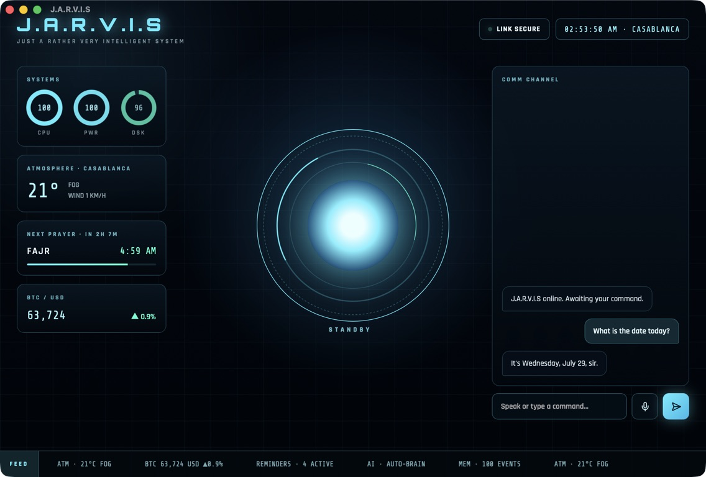
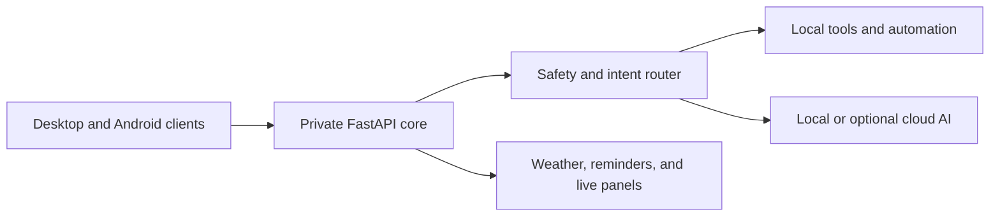

# JARVIS Local Assistant

JARVIS is a local-first personal assistant combining voice interaction, system
automation, live information panels, and privacy-conscious AI routing.

## Highlights

- Voice and text command channel
- Local system controls and telemetry
- FastAPI service with a web and Android client
- Local-model support with optional cloud providers
- Reminders, weather, prayer times, market data, and activity feed

## Architecture

## Source availability

The production implementation and automation logic are private and proprietary.
This public repository is a source-free product showcase.

Copyright © 2026 Ayoub Odf. All rights reserved.
